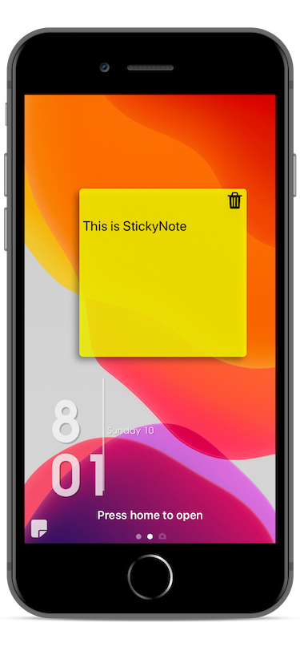
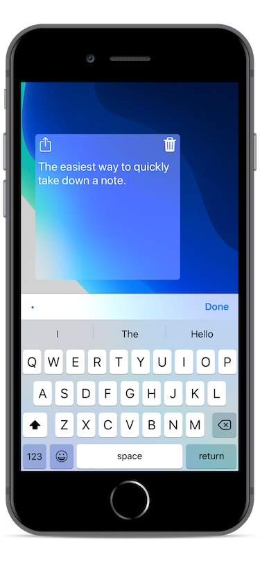
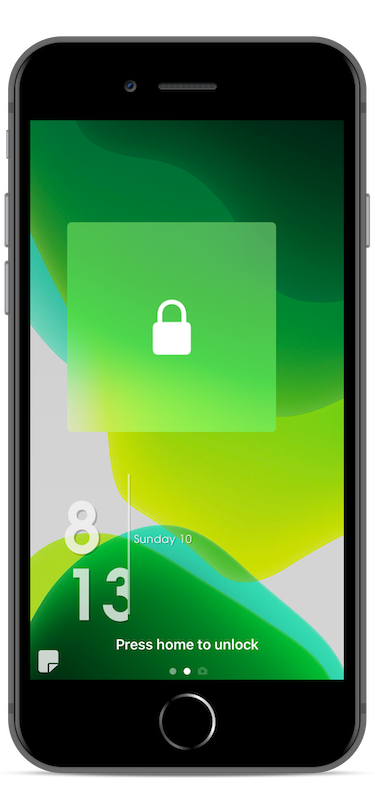
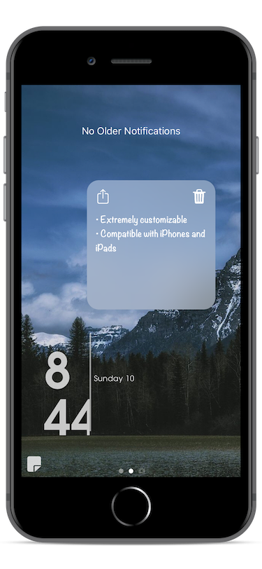
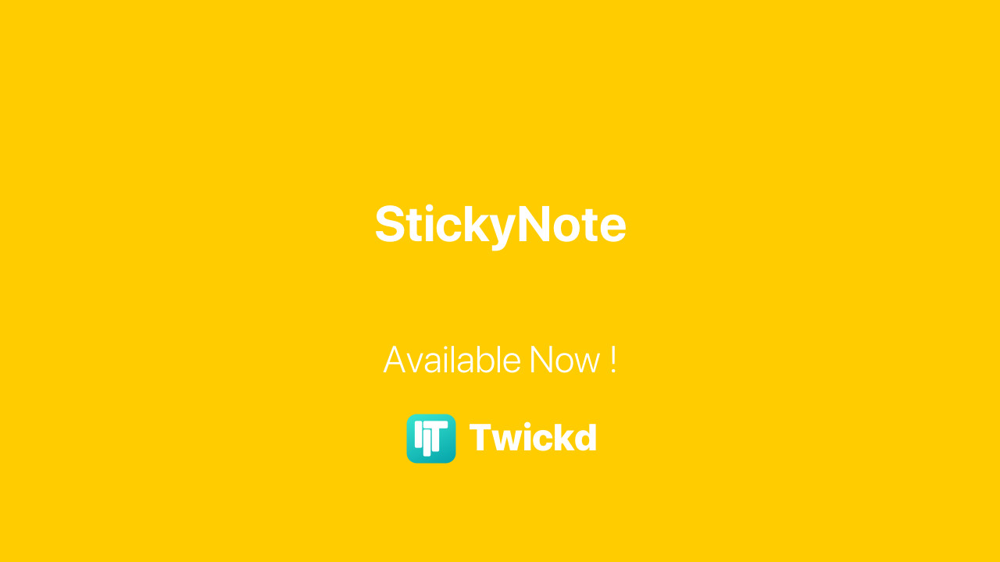

# StickyNote &nbsp;

Sometimes you need to take a note as quickly as possible, or write down a reminder without risk of forgetting about it. StickyNote is a tweak that provides a solution to these situations, by adding a handy sticky note to your device's lock screen / Cover Sheet.

## Features
* Immediate access
	* StickyNote lives on your device's lock screen / Cover Sheet, which means that it's the first thing you see when you unlock your device, and is always a swipe away when your device is unlocked
* Visible when you need it, gone when you don't
	* Hide the sticky note using the show/hide button to view your notifications without distraction
* Customization
	* Almost all of the aspects of the sticky note are customizable, including colors, fonts, sizing, animations, and more
* Security
	* Optional feature to hide the contents of the sticky note until you unlock your device; compatible with both Face ID and Touch ID
* Free and open source

## Screenshots

&nbsp;

&nbsp;

&nbsp;

## Installation
You can install this tweak on your jailbroken iOS device from the [Twickd repo](https://repo.twickd.com/package/com.twickd.gabriel-siu.stickynote)

## Compatibility
This tweak is compatible for iPhones and iPads running iOS 11 - 13

&nbsp;

Feel free to [follow me on Twitter](https://twitter.com/gabrielsiu_dev) for updates about my tweaks
